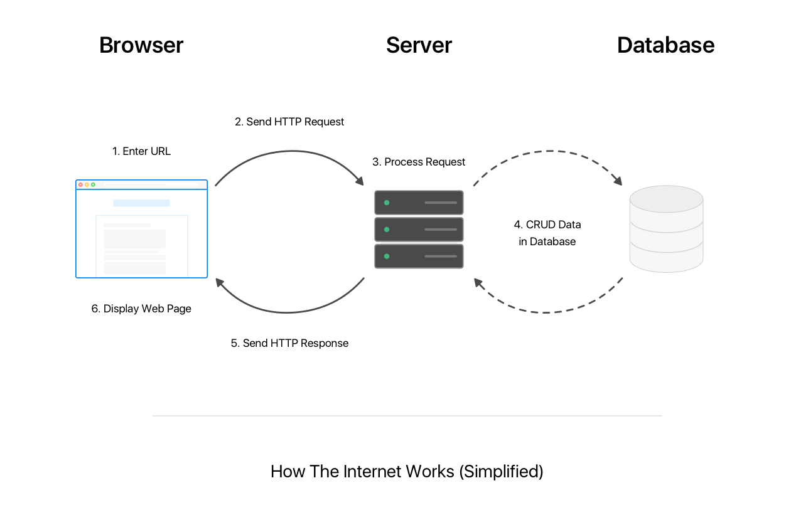
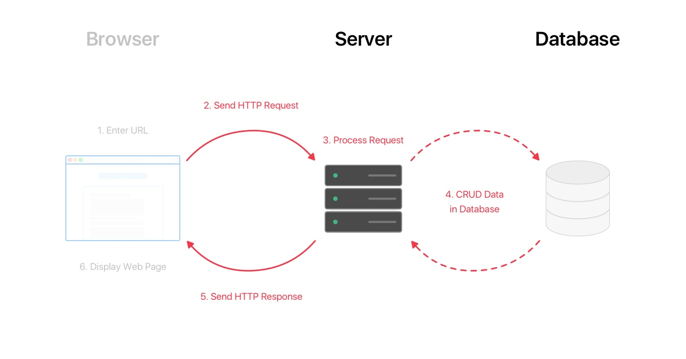
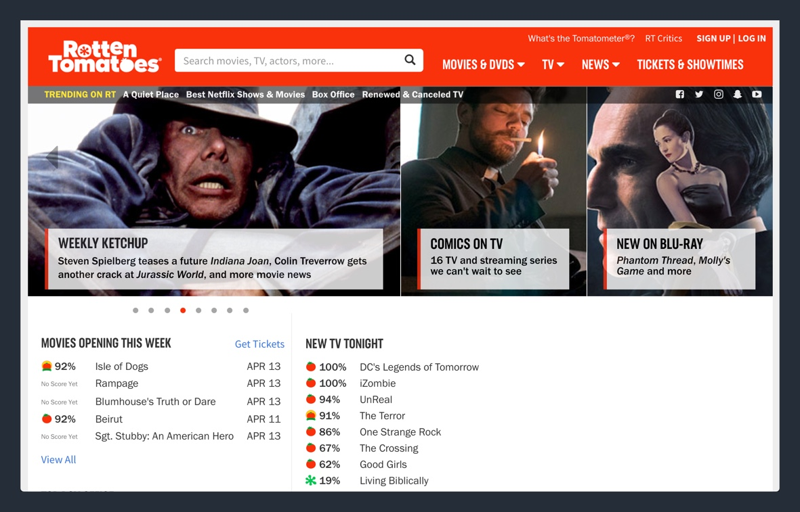
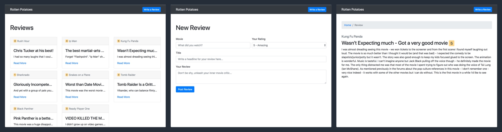

This is the fourth tutorial of Make School's full-stack web series! Up to this point, we've focused on front-end web development. In this tutorial, we'll take our first look at the back-end of our technology stack.

> [info]
>
Throughout the rest of this tutorial series, we'll place more emphasis on learning the back-end technologies. If you feel like you need a refresher, refer back to the previous tutorials on front-end development.

# What's a Web App?

To recap from the _How the Internet Works_ tutorial, a web application is a computer program that's running on a web server.

A web app will receive HTTP requests from clients (web browsers, mobile phones, smart fridges). After processing the request, it'll perform some logic based on code you write and return a response to the client.

# Who Is This For?

Beginning full-stack web developers who are familiar with the foundations of front-end web development.

## What You Should Already Know

How to build web pages using HTML, CSS, JavaScript and Bootstrap.

## Estimated Completion Time

3 Hours

# What We're Building

Our first web app will be a clone of the popular movie review website, [Rotten Tomatoes.](https://www.rottentomatoes.com/)

In our _Rotten Tomatoes_ clone, we'll be able to do the following:

1. Review and rate movies
2. View reviews left by previous users

We'll call it... Rotten Potatoes. *Ba dum tss*

## Our Design

Our web app will have 3 main web pages:

- **Homepage:** See movie reviews left by other users
- **New Review Page:** Rate and leave a new movie review
- **Individual Review Page:** View the full details of a single movie review

When we're done, it'll look like the following:

# What You'll Learn

By the end of this tutorial, you will:

- learn about the NodeJS and ExpressJS ecosystem
- setup a new express app using the express generator
- use NPM to install and use 3rd-party packages
- dynamically create views using Handlebars
- read and write data to a database using MongoDB and mLabs
- write code that handles GET and POST requests

# If You Get Stuck

Getting stuck when coding (and debugging) is a natural part of the programming process. If you find yourself stuck on a problem or lost, pause for a moment and take a breath. Maybe take a walk. Then retrace your steps (in the tutorial, not the walk). Make sure you've follow each step of the tutorial. It's easy to make typos or to accidentally skip over important steps.
