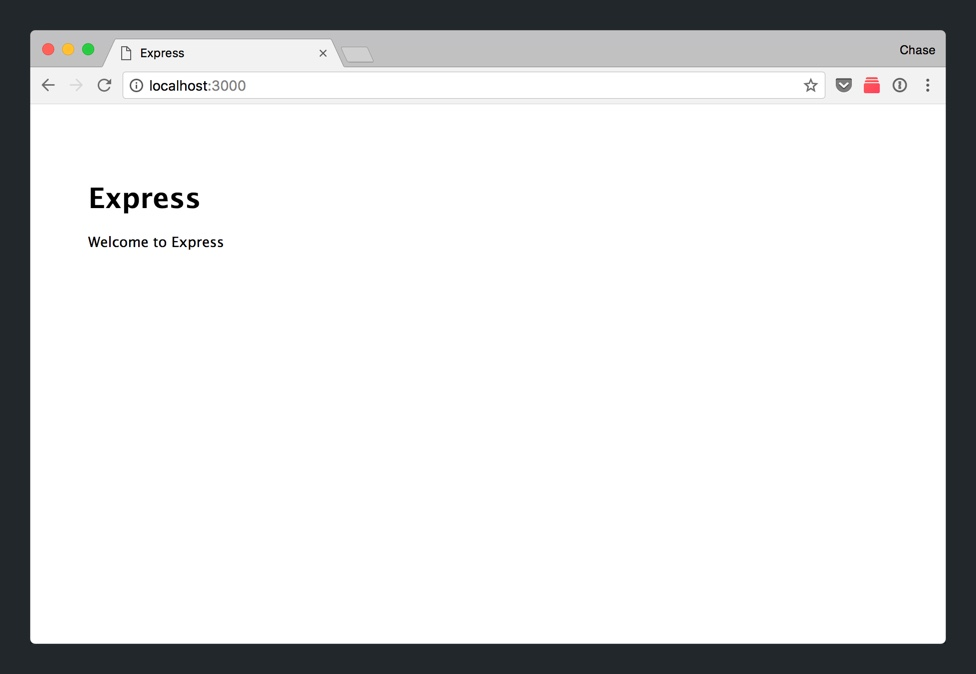

To start, we'll setup our developer environment and create a new project. We'll build our web app using the Node.js and Express.js frameworks.

# Node.js? Express..? 

When you're beginning, it's easy to get confused by all the different technologies, frameworks and what each of them do.

Node.js (commonly referred to as Node) is an _open-source, JavaScript runtime environment for executing server-side JavaScript._ This means that Node allows us to build server-side applications in JavaScript.

Express.js (Express) is a web framework that's built on top of Node. It provides a suite of features and tools that allow us to quickly create and setup a new web app.

> [info]
>
While we'll use Node and Express to build our web application, there are many other languages and web frameworks that you can use to build web apps. Some of the more popular ones are Ruby on Rails (Ruby), Django (Python), Laravel (PHP).

## Check If Node Is Installed

First, we'll need to make sure you've installed Node on your computer. Follow the appropriate instructions based on your computer's operating system.

### macOS

> [action]
>
Check if you already have Node installed on your macOS computer.
>
1. Open Terminal.
1. In the command line, write `node -v` and hit _Enter_.
1. If Node is installed, you should see the output of Node's version number (i.e. v8.9.2)
>


### Windows

> [action]
>
Check if you already have Node installed on your Windows computer.
>
1. Open the Window's Command Prompt.
1. In the command line, type `node -v` and hit _Enter_.
1. If Node is installed, you should see the output of Node's version number (i.e. v8.9.2)

## Installing Node (If Not Installed)

If Node is already installed on your computer, you can skip this step.

> [info]
>
If your Node version is below `v8.X.X`, follow the steps below to update Node to a newer version.

To install Node, navigate to the [Node.js website](https://nodejs.org/en/) and [download the installer](https://nodejs.org/en/download/) for your respective operating system.

When you're done, you can test that you've successfully installed Node by going through the steps above for checking whether Node is installed.


# Creating an Express Project

With Node installed, we can create our first Express project. We'll use the NPM package [Express Generator.](https://expressjs.com/en/starter/generator.html)

> [action]
>
Install _Express Generator_ that will install the `express` command-line tool that we can use to create a new Express project:
>
1. Open Terminal, or your equivalent command-line tool.
1. Install the `express-generator` package using NPM by typing `npm install express-generator -g` into your command-line tool and hitting _Enter._
>


With the _Express Generator_ package installed, let's move on to create our web app.

> [action]
>
Create a new Express project:
>
1. Open Terminal, or your equivalent command-line tool.
1. Navigate within your file directory to your folder of choice. 
1. Type `express --view=hbs rotten_potatoes` into your command line and hit _Enter._ 
>
The `--view=hbs` option specifies that our _view engine_ will be set to [Handlebars.js](https://handlebarsjs.com/). This specifies then framework we'll use to build and display our views (more on this later!)

Next, we'll need to install all of the NPM packages within our project.

> [action]
>
Install all of your project's NPM packages:
>
1. Navigate into your new project directory by typing `cd rotten_potatoes/`
1. Install all of your project's NPM packages using `npm install`

When you're done, open your project directory with your _Atom_ text editor.

> [action]
>
Open your project in _Atom_ by typing `atom .` 

We've created a new web app from scratch using the _Express Generator_ package.

# What's in our Project?

Let's take a walkthrough and look through what comes included in our new starting web app.

### package.json

> [action]
>
Let's start by opening `package.json` in _Atom_. 

Your `package.json` file contains a JSON of important metadata of your project such as the project name, it's version, and it's dependencies:

```
{
  "name": "rotten-potatoes",
  "version": "0.0.0",
  "private": true,
  "scripts": {
    "start": "node ./bin/www"
  },
  "dependencies": {
    "cookie-parser": "~1.4.3",
    "debug": "~2.6.9",
    "express": "~4.16.0",
    "hbs": "~4.0.1",
    "http-errors": "~1.6.2",
    "morgan": "~1.9.0"
  }
}
```

Previously, when we executed the `npm install` command, we were installing the dependencies listed in our `package.json` file.

```
"dependencies": {
  "cookie-parser": "~1.4.3",
  "debug": "~2.6.9",
  "express": "~4.16.0",
  "hbs": "~4.0.1",
  "http-errors": "~1.6.2",
  "morgan": "~1.9.0"
}
```

The code and files for the dependencies installed are located in our project's folder `node_modules/`.


When you're done, you can collapse the `node_modules/` folder so all of it's subfolders don't clutter your project tree.

> [info]
>
If you're wondering why the dependencies in our `package.json` don't match up one-to-one for the subdirectories in our `node_modules/` folder, it's because each of our dependencies have their own sub-dependencies and so on.

Next, we'll take look at `app.js`, your application's main entry point.

### app.js

The `app.js` file (sometimes named index.js or server.js), is the main entry point into your Express app.

The `app.js` initializes an instance of the Express app named `app` and then sets up it's configurations. In our case, _Express Generator_ has already taken care of a lot of this for us, but let's break some key pieces of code so that we can understand what's going on in `app.js`.

At the top of your `app.js`, you'll notice a lot of variables created using the `require` keyboard.

```JavaScript
var createError = require('http-errors');
var express = require('express');
var path = require('path');
var cookieParser = require('cookie-parser');
var logger = require('morgan');

var indexRouter = require('./routes/index');
var usersRouter = require('./routes/users');
```

The code above loads each of the respective modules so that we can executed various code in our `app.js` file.

Next, let's look at the line of code that creates and instance of our _Express_ app.

```JavaScript
var app = express();
```

Throughout the rest of the file, we'll use the `app` instance to setup and configure our web app.

For example, you'll notice the two lines below setup our _view engine_ to use handlebars.

```JavaScript
var app = express();

app.set('views', path.join(__dirname, 'views'));
app.set('view engine', 'hbs');
```

This specifies to our _Express_ app that we'll use _Handlebars.js_ to create the UI, or views, of our web app. We'll dive head-on into _Handlebars_ in the next section.

Another configuration that's set is the `public/` directory. This is where all of our static files (stylesheets, client-side scripts, image assets) will reside.

```JavaScript
app.use(express.static(path.join(__dirname, 'public')));
```

If you look inside your _Tree View_, you'll see the `public/` folder that house all of our static files.


Go ahead and open your `style.css` file and delete the default CSS that comes in it your project (we'll be adding Bootstrap later).

> [action]
>
Open `style.css` from your `public/stylesheets` folder and delete any CSS inside of it.

The last point we'll cover in our `app.js`, are it's routers.

Our routers will handle the logic for incoming HTTP requests depending on the URL path (i.e. /users/).

```JavaScript
app.use('/', indexRouter);
app.use('/users', usersRouter);
```

The `indexRouter` variable was created earlier from our `index.js` file in the `routes/` folder.

> [action]
>
Open `index.js` in your `routes/` folder. 

We won't make any changes in here yet, but just make a mental note that the `indexRouter` variable in `app.js` is connected to our `routes/index.js` file.

# Deleting the User Router

In our first web app, _Rotten Potatoes_, we won't implement the functionality for users. Since _Express Generator_, automatically generates an `userRouter` and it's accompanying `routes/user.js` file, we'll go ahead and delete this unneeded code.

> [action]
>
In `app.js`, delete the follow lines of code creating and referencing your `userRouter`:
>
```
// ...
>
// delete this line
var usersRouter = require('./routes/users');
>
// ...
>
// also delete this line
app.use('/users', usersRouter);
>
// ...
```

When you're done removing the `userRouter` from `app.js`, go ahead and delete the `routes/user.js` file. We'll no longer that code.

> [action]
>
Delete the `user.js` file in `routes/user.js`.

# Starting the Server

Before we move on, let's learn how to run our _Express_ app locally on our computer. Our app starts a server and listens to port 3000.

> [action]
>
Open your web browser and enter the url `http://localhost:3000/`. You'll see the following: 

Right now, Chrome tells us that this site can't be reached because we haven't started our server yet.

> [action]
>
Start your _Express_ app with the following steps:
>
1. Navigate to the root directory of your `rotten_potatoes/` project folder. 
1. Once you're inside your project directory, type the command `npm start` and hit _Enter._
>


If all runs smoothly, you'll be able to go back to your web browser, refresh the URL `http://localhost:3000/` and voila!



In all it's beauty, the _Express_ default homepage. You might have also noticed some movement in the terminal window of your running server.


> [info]
>
_Localhost_ refers to your computer. It's usually used to [access network services running on your computer.](https://en.wikipedia.org/wiki/Localhost) In our case, we'll use _localhost_ to interact between our web browser and our server.

# Up Next

At this point, you won't understand the cogs and gears that are turning to make this work. In the next section, we'll learn about how the _Express homepage_ is being shown by implementing the standard _Hello, World!_
