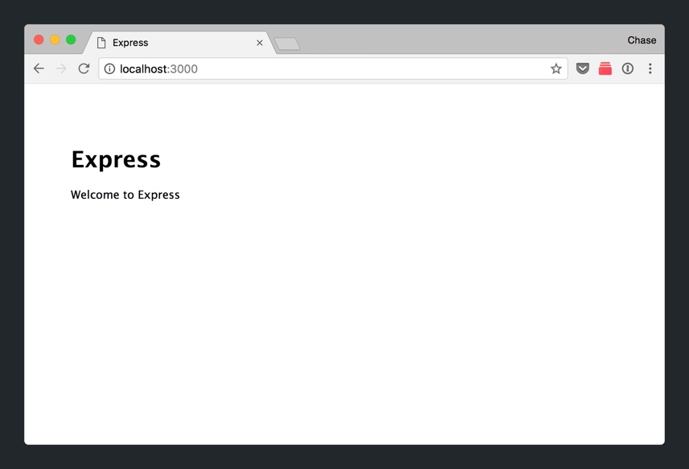
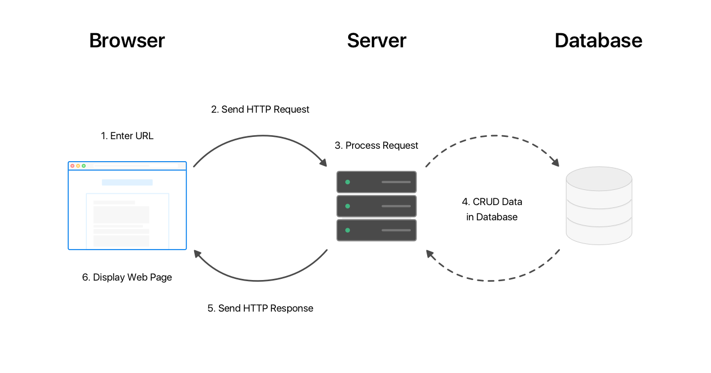
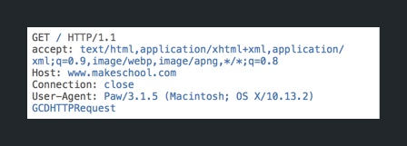
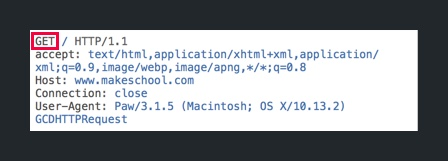
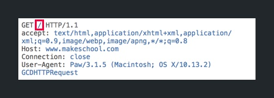
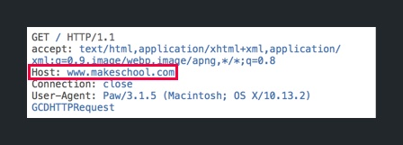
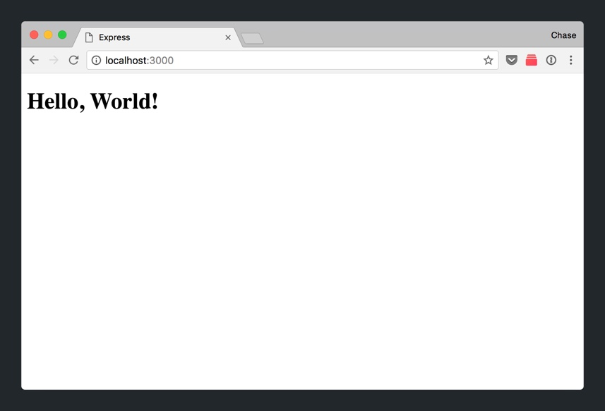
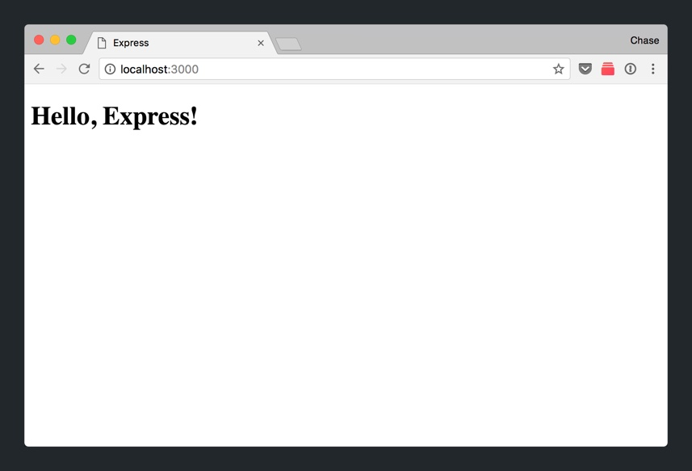
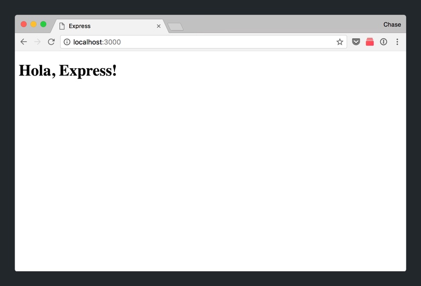

So you've created a new project and got it up and running. But how does it work?

In the previous section, we've went through our new project, but we never discussed the inner workings of what's going on when we navigate to `localhost:3000` and see the following:



In this section, we'll learn what goes on after our browser sends an HTTP request to our server and how our Express app processes the request. To review, let's look at our model of how our browser communicates with our back-end:



As we've learned, our web server receives a HTTP request, processes it and returns a HTTP response. This is also referred to as the HTTP request/response cycle.

Throughout this section, we'll look at the HTTP request/response cycle in the context of our Express app.

# HTTP Basics

Hypertext Transfer Protocol (HTTP) is specification of standarized rules (protocol) which allows different devices to communicate with each other via the internet. In the context of a web browser, it allows a web browser to request and receive a web page from a web server.

## What's in a HTTP Request?

Let's breakdown a HTTP request to see what information is being sent to our back-end.



Let's go over the most important parts of our HTTP request.

### HTTP Method



HTTP has a set of request methods, also referred to as HTTP verbs, that communicate what type of action the web app is to execute.

There are 4 main HTTP verbs that are frequently used:

<!-- TODO: what is a resource? -->

- **GET**: The GET method retrieves data about a resource. i.e. retrieve previous movie reviews
- **POST**: The POST method (usually) creates a new resource. i.e. create a new movie review
- **PUT**: The PUT method updates the existing data of a resource. i.e. edit a typo in your movie review
- **DELETE**: The DELETE method deletes a specified resource. i.e. deleting an inappopriate movie review

> [info]
>
There are 5 other less commonly used HTTP verbs: HEAD, CONNECT, TRACE, OPTIONS, and PATCH. You'll rarely run into a use case where you'll use these request methods. These are out of the scope of this tutorial.

### URI Path



The URI path specifies the resource that the client wants to access. In this particular request, we're accessing `/` which is the index (or root) path. The index path is commonly used to display the homepage of a web app (usually a landing page).

### Host



A host is a website on the internet that's identified by a host name. Host names are like street addresses that help your HTTP request find their destiation web servers.

> [info]
>
Aside from the parts of the HTTP request mentioned above, a lot of other data can also be sent via additional headers, data queries, or message bodies. We'll learn more about these other ways of sending data as we build our web app.

# Handling HTTP Requests

Let's walk through what happens when our Express app receives an HTTP request. First, we need to note that in our `app.js`, we've specified a router for our _Express_ app.

```JavaScript
// ...

var indexRouter = require('./routes/index');

// ...

app.use('/', indexRouter);

// ...
```

Matching the first argument of `app.use`, incoming HTTP requests beginning with the `/` URI path will be directed through our `indexRouter`. The code for our `indexRouter` is located in our `routes/index.js` file. Let's take a peak now.

> [action]
>
Open `routes/index.js`.

## Routers

Our router will attempt to match the the resource of our HTTP request with the correct HTTP verb and matching URL path.

```JavaScript
// ...

router.get('/', function(req, res, next) {
  res.render('index', { title: 'Express' });
});

// ...
```

Look at the code above. First, let's break apart the function.

The function name `router.get` matches each respective HTTP verb.

The first argument of the function `/` is the URL path that will determine if the callback in the function's second argument will be executed.

The function's second argument, as previously mentioned, is the callback that will be executed if the HTTP request matches both the HTTP verb and URL path of the function.

Next, let's look within function's second argument, the callback:

```JavaScript
// ...

function(req, res, next) {
  res.render('index', { title: 'Express' });
}

// ...
```

> [info]
>
Normally, there will be more code within the callback that performs logic, queries the database, etc. Since this is automatically generated by _Express Generator_, this callback only directly returns a _Handlebars_ template.

Within the callback, there's a line that will render our web page.

```JavaScript
res.render('index', { title: 'Express' });
```

The line of code above, renders our view.

The function name `res.render` means that our HTTP response (res for short) will return data to display the respective web page.

The first argument `index`, specifies that name of the _Handlebars_ template in the `views/` folder of our project directory. The second argument is data that we're passing to our _Handlebars_ template.

Let's look at our `views/index.hbs` _Handlebars_ template now.

> [action]
>
Open your `views/index.hbs` file from your _Tree View_.

## Views

You should be looking at your first _Handlebars_ template, as denoted by the `.hbs` extension. It looks like regular HTML, but it has some special syntax that you can use to embed _Handlebars expressions._

You can see that the title data we passed when we called `res.render` from our `routes/index.js` is being used with the special _Handlebars expression_ syntax.

Take a look:

```JavaScript
// routes/index.js

// ...

res.render('index', { title: 'Express' });

// ...
```

<!-- break -->

```
<!-- views/index.hbs -->

<h1>{{title}}</h1>
<p>Welcome to {{title}}</p>
```

Since the title data is being passed from our router to our view, when the HTML is returned in the HTTP response, we'll see the following:

```HTML
<!-- returned response -->

<h1>Express</h1>
<p>Welcome to Express</p>
```

In both instances, `{{title}}` has been subsituted for `Express`. When we start our web server and navigate to `http://localhost:3000`, we can see as follows:


Before we move on, let's review the HTTP request/response cycle once more.

1. Our `app.js` specifies routers that will match based off of incoming HTTP request URL paths.
1. Within our router, the incoming HTTP request is matched against it's HTTP verb and URL path.
1. If a match is made, the callback argument of the matching function will be executed.
1. Within the callback, the name of a view is specified along with any data that needs to be passed to the Handlebars template.
1. Finally the _Handlebars_ template is rendered and returned as data in the HTTP response to the client.

With our new knowledge of how our _Express_ app works, let's modified the default homepage of our _Express_ app to display 'Hello, World!'

# Building Hello World

Let's start by replacing our current `views/index.hbs` with the following HTML.

> [action]
>
In `views/index.hbs`, replace the contents with the following HTML:
>
```HTML
<h1>Hello, World!</h1>
```

Let's quit and restart our server to see our changes.

> [action]
>
Let's see our changes:
>
1. In the terminal window of your server, stop your web server by pressing `ctrl-c` twice.
1. In the same window, type the command `npm start` to start your server back up.
1. Last, in your browser window, refresh the webpage with the webaddress `localhost:3000`.
>


## Passing Data from Router to View

Let's open our index router again.

> [action]
>
Open `routes/index.js`

If you look at the line of code within our callback that renders the `index` template, you'll notice that we're still passing data from the index router to the index view.

```JavaScript
// routes/index.js

// ...

res.render('index', { title: 'Express' });

// ...
```

Let's take a look at how this works by passing this data to change the content of our HTML.

> [action]
>
In your `views/index.hbs` file, modify your HTML to use the following handlebars expression:
>
```HTML
<h1>Hello, {{title}}!</h1>
```

Restart your server and refresh your browser. You should see the following:



See how we were able to pass data from our review to our view? In our view, we were able to access the data using the handlebars expression `{{title}}`.

To drive this concept home, let's pass another bit of data.

> [action]
>
In `routes/index.js`, modify the code of your callback to the following:
>
```JavaScript
// routes/index.js
>
// ...
>
router.get('/', function(req, res, next) {
  res.render('index', { greeting: 'Hola', title: 'Express' });
});
>
// ...
```

Next, let's change our view to make use of the new `greeting` data passed to our template.

> [action]
>
In `views/index.hbs`, change the following:
>
```HTML
<h1>{{greeting}}, {{title}}!</h1>
```

Restart the server and refresh your browser. You should see the following:



# Moving On

In this section, we've covered a lot. We've learned about the full HTTP request/response cycle and how an HTTP request is processed by our web app. To really understand this, we walked through an example and set up 'Hello, World!' In the next section, we'll learn about 3rd-party packages and how to install and use them.
