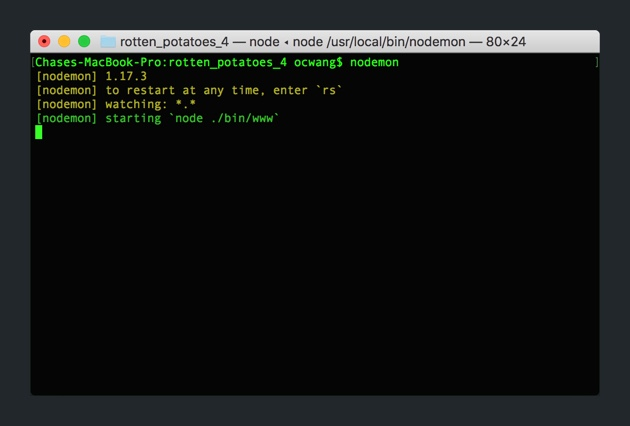
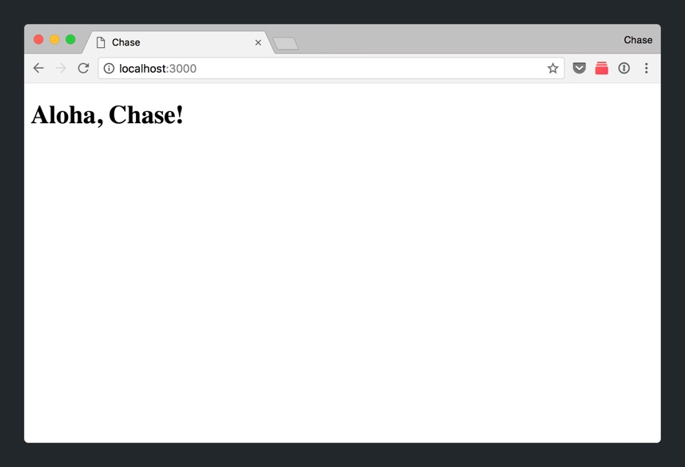

In this section, we'll learn about Node Package Manager (NPM) and use it into install a popular utility named Nodemon.

## What is NPM?

NPM, a package manager for JavaScript, allows you to easily find, use and manage code written by other developers.

Many developers write open-source NPM packages that others can find and use in their own projects. This allows for easy code re-use and prevents each developer having to build projects from scratch each time they start a new project.

A great example of this is _Express_, which is a NPM package that allows use to quickly setup a new web app. If _Express_ didn't exist, we would have to code a lot of basic functionality from scratch. Instead, through using _Express_, a lot of the setup and helper functions are abstracted away.

## package.json

If you recall, our `package.json` file contains all of the packages, along with their version, that are currently installed in our web app. Let's take a look.

> [action]
>
Open `package.json` from your project's root directory:
>
```
/* ... */

"dependencies": {
  "cookie-parser": "~1.4.3",
  "debug": "~2.6.9",
  "express": "~4.16.0",
  "hbs": "~4.0.1",
  "http-errors": "~1.6.2",
  "morgan": "~1.9.0"
}

/* ... */
```
>
As mentioned when we walked through out initial Express app, the dependencies that are listed in our `packages.json` file are NPM packages that have already been installed in our project through using the Express generator. In addition, you can see the version number of each package beside it's name.

Our `package.json` file lets us keep track and manage the NPM packages we're using in our project. NPM also allows us to easily update packages to newer versions.

> [info]
>
Remember? All the code for our packages are located in our `node_modules/` directory.

# Installing a New Package

Throughout the processes of implementing 'Hello, World!', we constantly had to terminate and restart our server each time we made any changes to our code base. Although it might not seem too big of a deal, it gets tedious if you're making changes constantly.

Now, we're going to install a new package named [_nodemon_](https://nodemon.io/), short for node monitor, that reloads our server automatically whenever we **save a change** to any JavaScript file in our project.


First, let's install the package.

> [action]
>
Install the `nodemon` package to your project:
>
```
npm install -g nodemon
```

> [info]
>
Typically, nodemon would be installed with the `-g` or `--save-dev` flags because we'll only need this feature during development. We won't these flags for simplicity, but if you're interested you can read more [here](https://stackoverflow.com/questions/22891211/what-is-the-difference-between-save-and-save-dev) and [here](http://imcodebased.com/npm-save-or-save-dev-which-one-to-use/).

# Running Nodemon

With _nodemon_ installed, we can now start our server using it. Let's start our server.

> [action]
>
Start your server using _nodemon_:
>
1. In terminal, navigate to your project's root directory.
1. Instead of using the command `npm start`, we're going to type the command `nodemon` and hit _Enter_.
>
_nodemon_ will search for the `scripts.start` property in `package.json` which will start our server. 

With our server running, let's test that _nodemon_ works as expected.

## Testing Nodemon

Let's see nodemon in action. We'll change some JavaScript code in our `index.js` and see if we can refresh our browser without needing to restart our server.

First, if you haven't already, start your server with _nodemon_ and open `localhost:3000` in your web browser.


Next, let's make some changes to our code.

> [action]
>
In `routes/index.js`, modify the data passed to your Handlebars template:
>
1. Change the `greeting` value from `Hola` to hello in your language of choice. For example, in Hawaiian we'd use `Aloha`.
2. Change the `title` value from `Express` to your own name.
>
```
// routes/index.js
>
// ...
>
router.get('/', function(req, res, next) {
  res.render('index', {
    greeting: "Aloha",
    title: "Chase"
  });
});
>
// ...
```

To test that _nodemon_ is working as expected, we'll refresh our browser **without** restarting our server. 

> [action]
>
Refresh `localhost:3000` in your browser. You should see the following: 

Over are the days that we'll need to constantly stop and restart our server. Instead, when we make changes to our code, we can just save our code, refresh our browser and our server will be updated.

# Up Next

_nodemon_ is one of many packages of NPM. Before implementing new features, you should research (through a combination of _Google_, _Stackoverflow_ and _NPM_) to see if a package already exists. Fully utilizing NPM will save you a lot of time from always writing code from scratch.

In the next section, we'll dive a little deeper into Handlebars to learn how our web pages are being rendered with Handlebars.js.
