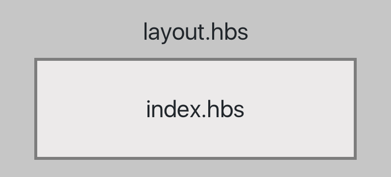
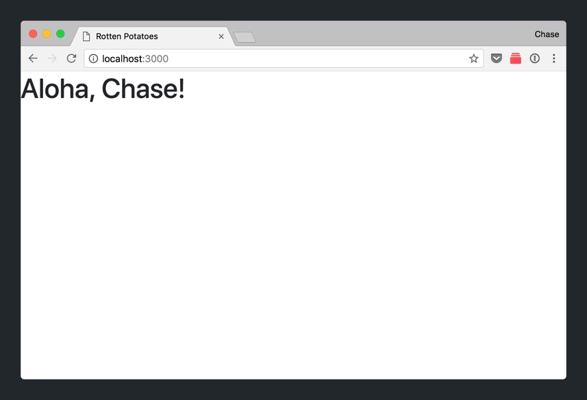

[Handlebars.js](https://handlebarsjs.com/) is one of many view engines that _Express_ supports.  Handlebars allows us to create our views, the HTML content, that will be display on each web page. In addition, it provides many useful handy features that allow us to embed handlebars expressions and build re-usable HTML.

Throughout this tutorial series, we'll get familiar with Handlebars.js because it's ease of setup and similarity to vanilla HTML.

# layout.hbs

Let's open `views/index.hbs`.

> [action]
>
Open `views/index.hbs` from your project:
>
```
<h1>{{greeting}}, {{title}}!</h1>
```

You probably noticed that `views/index.hbs` doesn't include a lot of the standard boilerplate of a HTML document. It's missing a `<head>` element, the `<body>` tags, etc.

However, if you inspect source of our 'Hello, World!' web page, you'll see that our boilerplate HTML exists: 

What's going on here?

To find out, let's take a look at `views/layout.hbs`.

> [action]
>
Open `views/layout.hbs` from your project:
>
```
<!DOCTYPE html>
<html>
  <head>
    <title>{{title}}</title>
    <link rel='stylesheet' href='/stylesheets/style.css' />
  </head>
  <body>
    {{{body}}}
  </body>
</html>
```
>
All of the HTML boilerplate we were missing!

Pay attention in particular to the handlebars expression `{{{body}}}`. This is what's connecting `views/index.hbs` and `views/layout.hbs`.

The HTML content of `index.hbs` is subsituted for `{{{body}}}` within `layout.hbs`.



This setup allows us to avoid repeating the same boilerplate HTML setup for each of our web pages. Let's go ahead and take this chance to add Bootstrap to our project.

## Adding Bootstrap

We'll start by replacing the HTML in `layout.hbs`. We'll use the starter template found in [Bootstrap's documentation](https://getbootstrap.com/docs/4.0/getting-started/introduction/#starter-template).

> [action]
>
In `views/layout.hbs`, modify your HTML to the following:
>
```HTML
<!DOCTYPE html>
<html lang="en">
  <head>
    <meta charset="utf-8">
    <meta name="viewport" content="width=device-width, initial-scale=1, shrink-to-fit=no">
>
    <!-- Bootstrap CSS -->
    <link rel="stylesheet" href="https://maxcdn.bootstrapcdn.com/bootstrap/4.0.0/css/bootstrap.min.css" integrity="sha384-Gn5384xqQ1aoWXA+058RXPxPg6fy4IWvTNh0E263XmFcJlSAwiGgFAW/dAiS6JXm" crossorigin="anonymous">
    <link rel="stylesheet" href="/stylesheets/style.css" />
>
    <title>Rotten Potatoes</title>
  </head>
  <body>
    {{{body}}}
>
    <script src="https://code.jquery.com/jquery-3.2.1.slim.min.js" integrity="sha384-KJ3o2DKtIkvYIK3UENzmM7KCkRr/rE9/Qpg6aAZGJwFDMVNA/GpGFF93hXpG5KkN" crossorigin="anonymous"></script>
    <script src="https://cdnjs.cloudflare.com/ajax/libs/popper.js/1.12.9/umd/popper.min.js" integrity="sha384-ApNbgh9B+Y1QKtv3Rn7W3mgPxhU9K/ScQsAP7hUibX39j7fakFPskvXusvfa0b4Q" crossorigin="anonymous"></script>
    <script src="https://maxcdn.bootstrapcdn.com/bootstrap/4.0.0/js/bootstrap.min.js" integrity="sha384-JZR6Spejh4U02d8jOt6vLEHfe/JQGiRRSQQxSfFWpi1MquVdAyjUar5+76PVCmYl" crossorigin="anonymous"></script>
  </body>
</html>
```
>
We added some extra meta tags, along with the stylesheet and scripts to support Bootstrap. Notice that our `{{{body}}}` code still remains as the first element within our `<body>` tags. We've also changed the content of our <title> element from using {{title}} to a static value of our web app's name.

If you refresh your browser, you'll notice the update of our CSS.



With Bootstrap set up, let's look at a feature named _Handlebars_ expressions that we'll need to display data from our routers.

# Handlebars Expressions

[Handlebars expressions](http://handlebarsjs.com/expressions.html) allow us to retrieve and display data passed from a router. We've already made use of this feature as we implemented 'Hello, World!'

```
<h1>{{greeting}}, {{title}}!</h1>
```

Both `greeting` and `title` are properties passed as an argument from `routes/index.js`. Let's practice this concept by implementing a new _route_ in our index router with a URL path of `/test`.

> [action]
>
In `routes/index.js`, implement a new _route_ with the URL path `/test`:
>
```
// ...
router.get('/', function(req, res, next) {
  res.render('index', {
    greeting: "Aloha",
    title: "Chase"
  });
});
>
// create new route below
router.get('/test', (req, res) => {
  // render Handlebars template here...
});
>
// ...
```
>
You'll notice that we've created a new GET _route_ below with a URL path of `/test`. Our callback uses the arrow function syntax and omits the `next` parameter.

Next, we'll need to render a _Handlebars_ template inside our callback that will be returned by our response.

> [action]
>
In `routes/index.js`, modify the callback of your `/test` route to the following:
>
```
router.get('/test', (req, res) => {
  res.render('test', { data: 'test' })
});
```

If we navigate to the URL `localhost:3000/test` in our browser, you'll see the following:


This is because we're trying to access a file in our `views/` folder named `test.hbs`. However, `test.hbs` currently doesn't exist. We'll need to create it next.

> [action]
>
Create a new handlebars template in your `views/` folder named `test.hbs`. Within your file, add the following HTML:
>
```
<h1>Testing... 1, 2, 3.</h1>
```

If you refresh `localhost:3000/test` in your browser, you'll see the Handlebars template we just created.


Last, let's display the data we passed from our callback in `routes/index.js` in our new view. Do you remember how we previously passed data between our router and our view?

> [challenge]
>
Using the Handlebars expression syntax, change the HTML content so that it will display the following when rendered: 

When you're done, check your solution below.

> [solution]
>
In `views/test.hbs`, you should have the following code:
>
```
<h1>Testing... 1, 2, 3. This is a {{data}}.</h1>
```

Finally, we'll explore displaying arrays of data using the `#each` syntax.

## Display Arrays of Data

We can use the `#each` syntax to display arrays of content.

> [action]
>
In `routes/index.js`, add the following array in our code:
>
```
// ...
>
let testArray = [
  { data: 'Snickersnee' },
  { data: 'Cattywampus' },
  { data: 'Gardyloo' },
  { data: 'Taradiddle' },
  { data: 'Bumfuzzle' }
];
>
router.get('/test', (req, res) => {
  res.render('test', {
    data: 'test'
  })
});
```

In our array, we've added a lot of object of nonsensical data. Let's learn how to use the `#each` Handlebars expression to display this data. First, we''ll change the callback of our test route to pass the `testArray` items.

> [action]
>
In `routes/index.js`, modify your `/test` route callback to the following:
>
```
// ...
>
router.get('/test', (req, res) => {
  res.render('test', {
    data: 'test',
    // 1
    test_items: testArray
  })
});
>
// ...
```
>
We change our code so that we pass the `testArray` as a property named `test_items`. This allows us to access `testArray` in our view.

Next, let's navigate to our test view.

> [action]
>
In `views/test.hbs`, add the following code to display our list of arrays:
>
```
<h1>Testing... 1, 2, 3. This is a {{data}}.</h1>
>
<ul>
  {{#each test_items}}
    <li>{{this.data}}</li>
  {{/each}}
</ul>
```
>
Notice how we use the opening `{{#each array_name}}` and closing `{{/each}}` to iterate through our array of data. Within the `#each` Handlebars expression, we access the property of each individual object through `{{this.propertyName}}`.

Refresh the browser and you should see the following: 

We can even add some style using the following Bootstrap classes for [list groups](https://getbootstrap.com/docs/4.0/components/list-group/#flush).

> [action]
>
In `views/test.hbs`, add the following `list-group` classes to our unordered list:
>
```
<h1>Testing... 1, 2, 3. This is a {{data}}.</h1>
>
<ul class="list-group list-group-flush">
  {{#each test_items}}
    <li class="list-group-item">{{this.data}}</li>
  {{/each}}
</ul>
```

When you're done, refresh your browser, and you should see the following: 

As you can see, Handlebars makes it really easy to iterate through list of data using its `#each` expression.

# Up Next

In this section, we've taken a closer look at Handlebars and it's features. In the upcoming section, we'll learn about REST resources and implement our first web page for _Rotten Potatoes._
