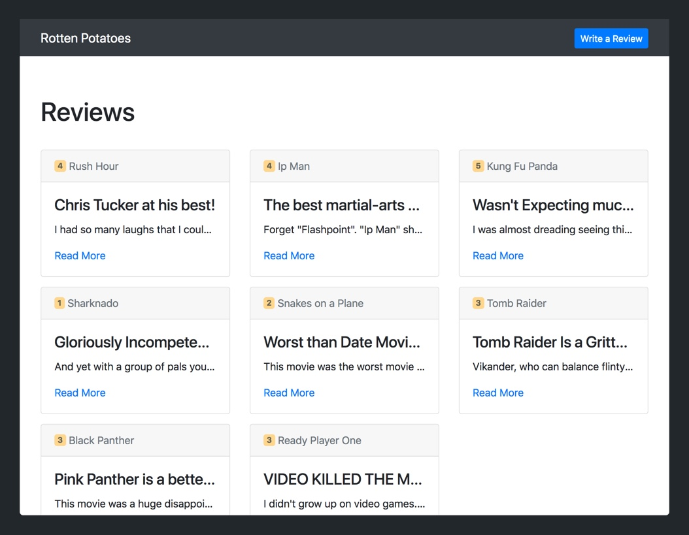
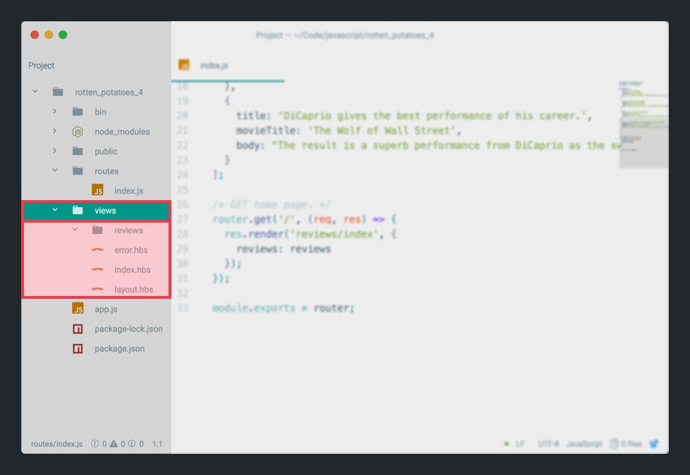
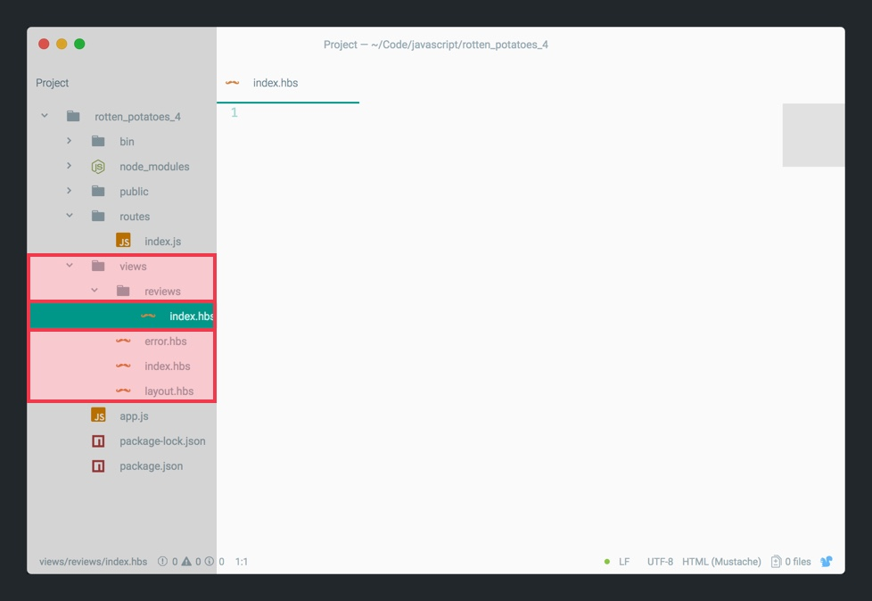
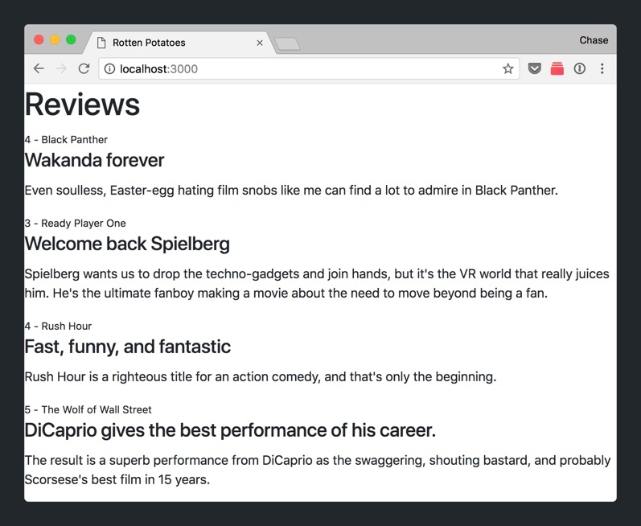
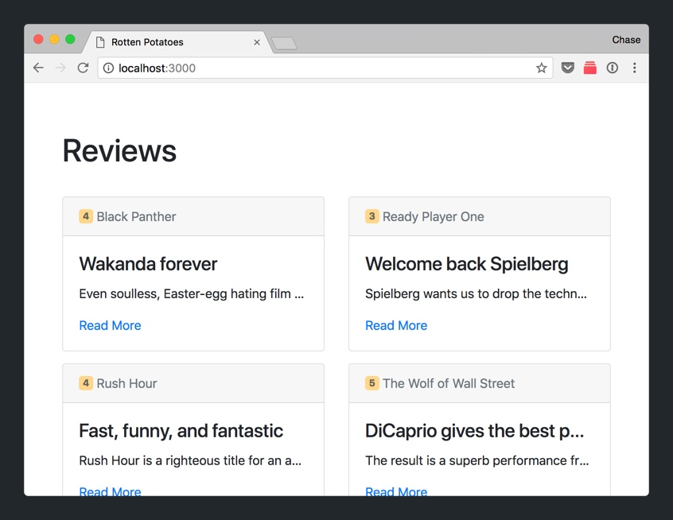

REpresentational State Transfer, more commonly known as REST, is an architectural style used in web development. REST sets standards for how devices should communicate with each other via HTTP and the internet.

In this section, we'll learn about REST, it's terminology and start implementing our first REST route for Rotten Potatoes.

# Speaking in REST

We can't learn about REST without learning about some of it's key terminology, specifically regarding resources, CRUD and routes.

A REST resource refers to an object that is an abstraction of data. Some common examples might include users, blog posts and in our case, movie reviews.

With each resource, we'll need to be able perform _CRUD_ operations. _CRUD_ is an abbreviation for Create, Read, Update, Delete. Let's say your web app had a _User_ resource. You'd want to support the following CRUD operations:

- Create: Creating new users
- Read: Retrieving and displaying data of existing users
- Update: Editing existing user information
- Delete: Deleting users

For each CRUD operation, we'll need to create a _route_. A _route_ consists of a HTTP verb and a URL path that usually corresponds to a resource.

In our codebase, we've already created two routes in `routes/index.js`. Let's take a look:

```
//...
>
router.get('/', function(req, res, next) {
  res.render('index', {
    greeting: "Aloha",
    title: "Chase"
  });
});
>
// ...
>
router.get('/test', (req, res) => {
  res.render('test', {
    data: 'test',
    test_items: testArray
  })
});
>
// ...
```

As you can see, each route has a HTTP verb and a URL path. In the two cases above, both are GET requests that have a URL path of `/` (index) and `/test` respectively.

> [info]
>
One thing to note of our current routes is that they don't perform an CRUD operations for a given resource. We'll add code with each route's callback to perform each operation soon.

## Deleting a Route

Before we move further, let's go ahead and delete our `/test` route.

> [action]
>
Delete the `/test` route and it's corresponding view files.
>
1. In `routes/index.js`, delete the `/test` route.
1. In `routes/index.js`, delete the variable `testArray`.
1. In your `/views` folder, delete the Handlebars template `views/test.hbs`.

Verify that your `routes/index.js` file only a single route:

```JavaScript
// ...
>
router.get('/', function(req, res, next) {
  res.render('index', {
    greeting: "Aloha",
    title: "Chase"
  });
});
>
// ...
```

# Creating our Index Route

Rotten Potatoes is a website of movie reviews. We'll be able to create new reviews and view previous reviews left by other movie critics.

> [challenge]
>
What do you the _resource_ of our web app is going to be?

<!-- break -->

> [solution]
>
We'll have one resource for Rotten Potatoes called _Review_. Each _review_ will represent a movie review.

We'll begin coding by modifying our existing index path to display our Rotten Potatoes homepage.



## Creating Test Data

We'll start off by first creating some sample data we can use to display in our view.

> [action]
>
In `routes/index.js`, add the following array of data right above your existing index `/` route:
>
```
let reviews = [
  {
    title: 'Wakanda forever',
    movieName: 'Black Panther',
    rating: 4,
    body: 'Even soulless, Easter-egg hating film snobs like me can find a lot to admire in Black Panther.'
  },
  {
    title: 'Welcome back Spielberg',
    movieName: 'Ready Player One',
    rating: 3,
    body: "Spielberg wants us to drop the techno-gadgets and join hands, but it's the VR world that really juices him. He's the ultimate fanboy making a movie about the need to move beyond being a fan."
  },
  {
    title: 'Fast, funny, and fantastic',
    movieName: 'Rush Hour',
    rating: 4,
    body: "Rush Hour is a righteous title for an action comedy, and that's only the beginning."
  },
  {
    title: 'DiCaprio gives the best performance of his career.',
    movieName: 'The Wolf of Wall Street',
    rating: 5,
    body: "The result is a superb performance from DiCaprio as the swaggering, shouting bastard, and probably Scorsese's best film in 15 years."
  }
];
```
>
We'll use this array of movie review data to populate the fake reviews of our index views. The data here is taken from real reviews off of sites like _Rotten Tomatoes_ and _IMDB_. It's always useful to use real data to get a feel for what your web app will look like when people are using it.

<!-- break -->

> [info]
>
If you're wondering why we're using fake data, it's because to fully implement our RESTful resource for _Reviews_, we'll need to setup our database MongoDB. Right now, we'll get our index `/` route working correctly so that once we setup our database, all of our other code will already be implemented.

Next, we'll modify our current index `/` route to display a new Handlebars template and pass the correct reviews data.

> [action]
>
In `routes/index.js`, modify your index `/` route to the following:
>
```JavaScript
// ...
>
router.get('/', (req, res) => {
  res.render('reviews/index', { reviews: reviews });
});
>
// ...
```
>
In the code above, we change the following:
>
1. The callback is now using arrow syntax.
1. The response `res` renders a new Handlebars template that we haven't created yet named `reviews/index`.
1. We pass our reviews array data as a property named `reviews` to our new view.

With our modified index route, we'll need to create a new view. However, there's something special about the syntax of the new template we're rendering. `reviews/index` indicates that our new template will be named `index.hbs` and be located at the file location of `views/reviews/`. This convention helps us organize our views by resource.

With this in mind, let's create our new index view.

> [action]
>
Create a new Handlebars template for our index route:
>
1. Create a new subfolder within `views/` named `reviews/`. 
1. With your `views/reviews/` folder, create a new template named `index.hbs`. 

Finally, we'll add some HTML to display our movie reviews.

> [challenge]
>
In `views/reviews/index.hbs`, use HTML and the `#each` handlebars expression to implement the following: 

Check your solution below.

> [solution]
>
In `views/reviews/index.hbs`, you should have the following:
>
```HTML
<h1>Reviews</h1>
>
{{#each reviews}}
  <small>{{this.rating}} - {{this.movieName}}</small>
  <h4 class="card-title">{{this.title}}</h4>
  <p class="card-text">{{this.body}}</p>
{{/each}}
```

Refresh `localhost:3000` in your browser to see your hard work thus far.

# Style On It

Right now, we're passing static movie reviews from our `routes/index.js` to `views/reviews/index.hbs`. However, our current implementation doesn't look anything like our design. We'll work on this next by adding some more HTML and CSS.

> [action]
>
In `views/layout.hbs`, enclose the `{{{body}}}` expression within a Bootstrap `.container`:
>
```
// ...
>
<body>
  <!-- insert container below -->
  <div class="container">
      {{{body}}}
  </div>
>
// ...
>
</body>
>
// ...
```

Next, we'll modify the HTML within our `views/reviews/index.hbs` by making use of the Bootstrap grid and some extra classes we'll use for CSS.

> [action]
>
In `views/reviews/index.hbs`, modify the HTML content to the following:
>
```HTML
<div class="row">
    <div class="col">
        <h1 class="page-title">Reviews</h1>
    </div>
</div>
>
<div class="row">
    {{#each reviews}}
        <div class="col-12 col-md-6 col-lg-4">
            <div class="card review">
                <div class="card-header text-muted">
                    <span class="badge badge-rating">{{this.rating}}</span> {{this.movieName}}
                </div>
                <div class="card-body">
                    <h4 class="card-title">{{this.title}}</h4>
                    <p class="card-text">{{this.body}}</p>
>
                    <a class="card-link" href="">Read More</a>
                </div>
            </div>
        </div>
    {{/each}}
</div>
```
>
We won't cover a lot of the Bootstrap classes and components above but if you're interested you can look at the documentation by [clicking here](https://getbootstrap.com/docs/4.0/components/card/).

Last, we'll add some additional CSS to smooth out our HTML content.

> [action]
>
In `public/stylesheets/style.css`, add the following CSS:
>
```CSS
.page-title {
    margin: 60px 0 35px;
}
>
.review {
    margin-bottom: 15px;
}
>
.review .card-title, .review .card-text {
    white-space: nowrap;
    overflow: hidden;
    text-overflow: ellipsis;
}
>
.review .badge {
    vertical-align: text-bottom;
}
>
.badge-rating {
    background-color: #FFD68C;
    color: #656152;
}
```

Refresh your web browser and you should see the data of your `reviews` array display in Bootstrap cards.



Not too bad huh?

# Up Next

Right now, all of our data is static test data from our `reviews` array in `routes/index.js`. In order to allow store and retrieve reviews, we'll need a place to store our _Review_ resource.

Enter the database. 

A database will allow us to add (**C**reate, retrieve (**R**ead), **U**pdate and **D**elete data. In the next section, we'll setup MongoDB so we'll be able to perform CRUD operations in our web app.
