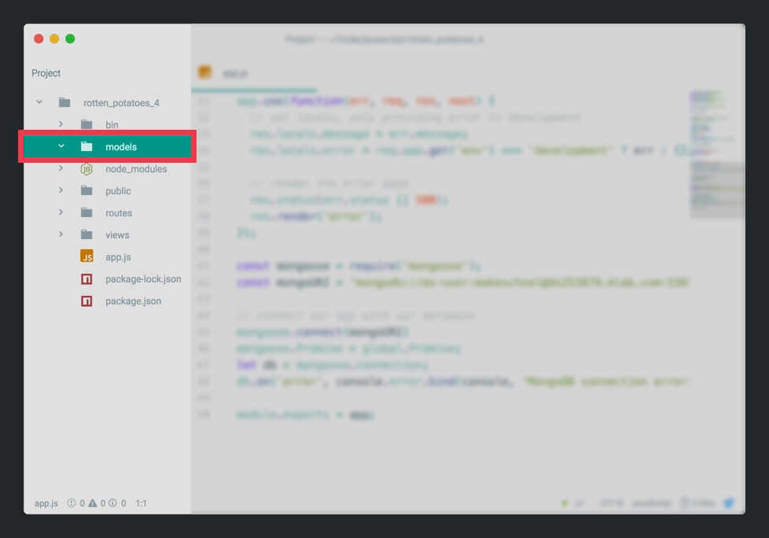
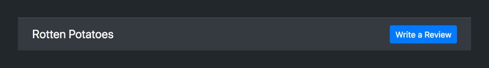
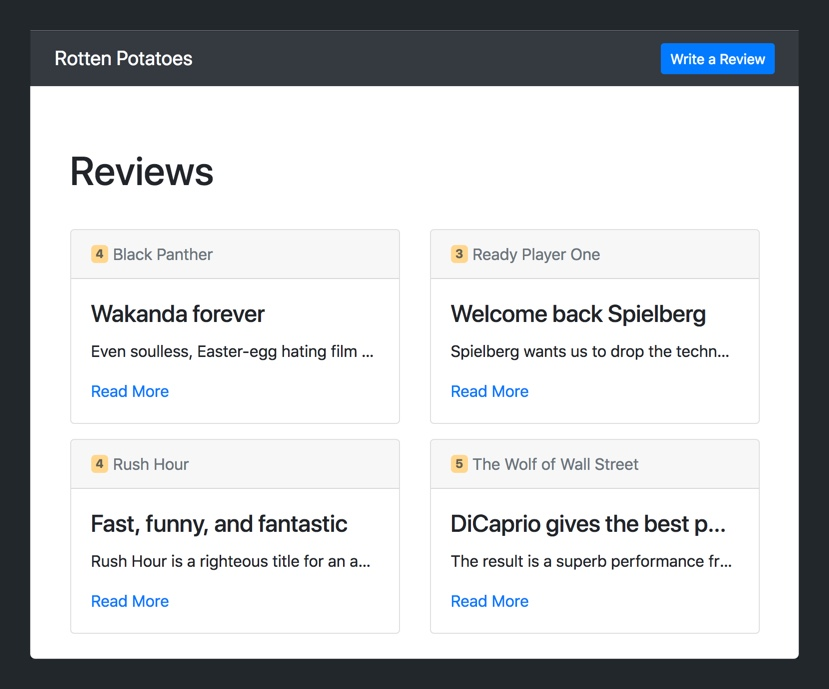
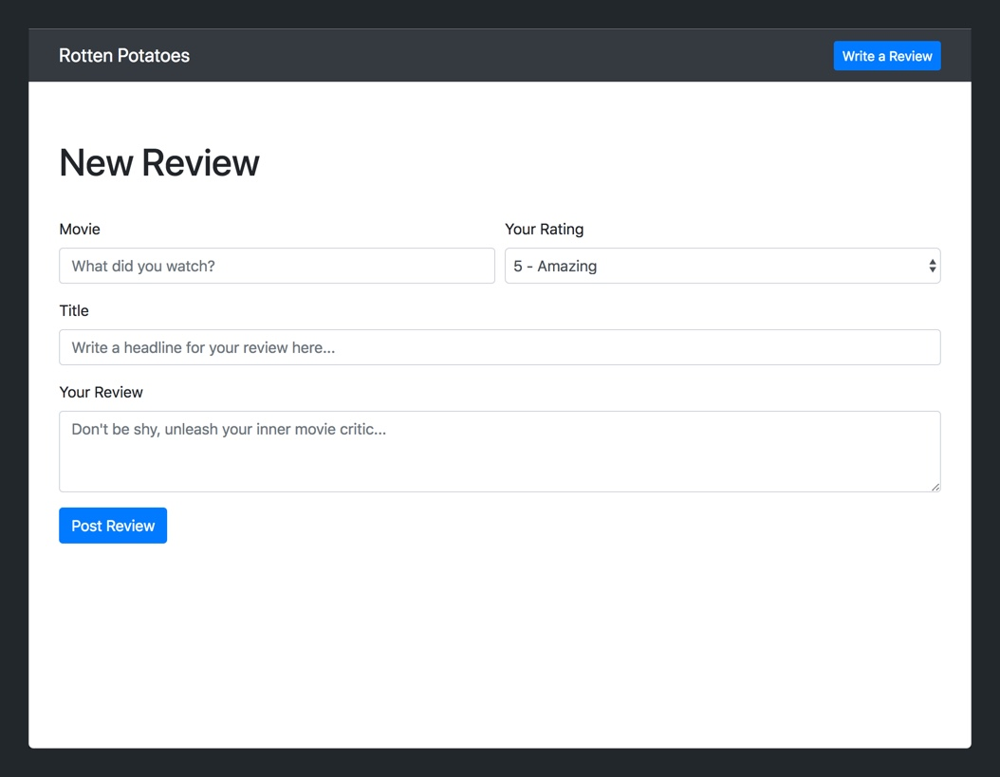
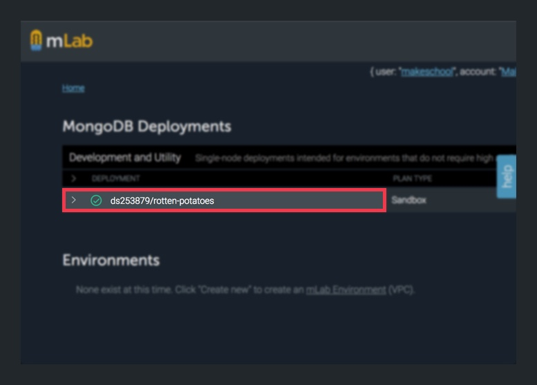
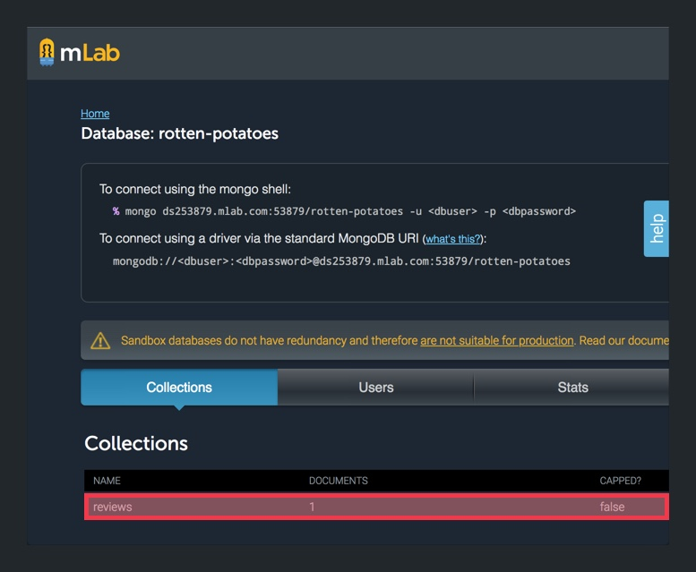
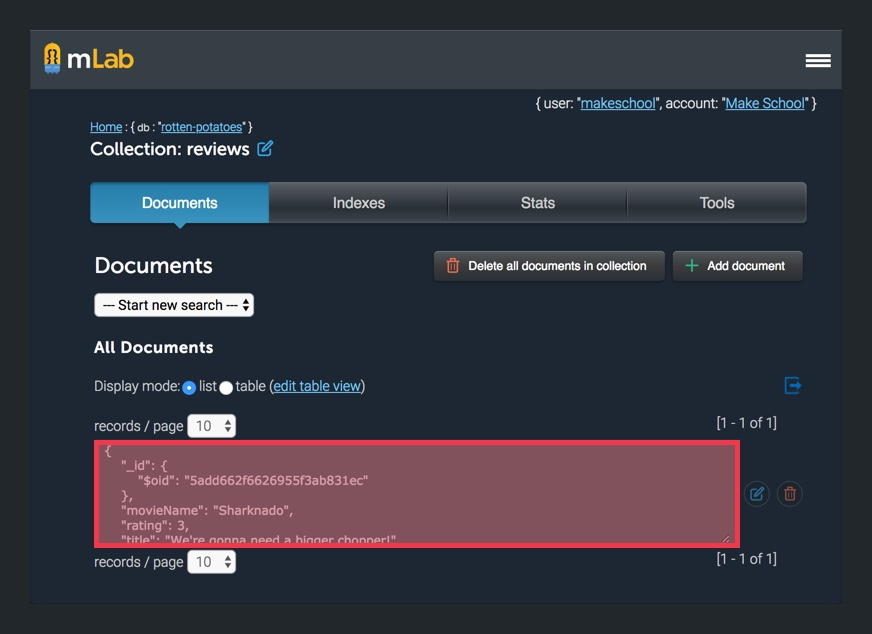

Although we've set up our database, we've yet to test it. In this section, we'll make sure everything's connected properly by implementing our first _CRUD_ operation. Specifically, we'll add the functionality for users to create new movie reviews.

# Building our Review Model

First, we'll need a new data model to represent our movie review data. Whenever we want to represent data within our MongoDB database, we'll need to create a model for it. In this case, our model will be our _Review_ resource.

Our _Review_ model will have the following properties:

- `movieName`: `String`
- `rating`: `Number`
- `title`: `String`
- `body`: `String`

Let's create a new directory to house our new model.

> [action]
>
In your project's root directory, create a new folder named `models/`. 

<!-- break -->

> [info]
>
Creating a `models/` directory is great for keeping our project organized. Normally, our project would have multiple models, sometimes with relationships between them. Even though this project only has a single _Review_ model, we'll keep our models organized to start building good habits.

Inside our new `models/` directory, let's create our first model.

> [action]
>
In our `models/` directory, create a new file named `review.js`. Add the code below:
>
```JavaScript
const mongoose = require('mongoose');
const Schema = mongoose.Schema;
>
// 1
const ReviewSchema = new Schema({
  movieName: { type: String, required: true },
  rating: { type: Number, required: true },
  title: { type: String, required: true },
  body: { type: String, required: true }
});
>
// 2
const Review = mongoose.model('Review', ReviewSchema);
module.exports = Review;
```
>
In the code above:
>
1. We create a schema for our movie review. We include the properties of our review model as well as their type and whether they are required.
1. We define the model on our mongoose instance making the model available to use in our project via the mongoose instance.

<!-- break -->

> [info]
>
With our new model, we'll eventually be able to remove our fake review data in `routes/index.js` for our index `/` route. We'll handle that in the next section when we learn about reading data from our database.

# Implementing our Navbar

Next, we'll need to build a navbar for our website. It'll need to include our _Write a Review_ button that takes us to a form that allows us to write a new review.



We'll want our navbar to be visible across all of our views, so we'll implement the HTML code in `views/layout.hbs`. Let's add that now.

> [action]
>
In `views/layout.hbs`, add the Bootstrap navbar right above your `.container` `<div>` element:
>
```
<body>
  <nav class="navbar navbar-expand-lg navbar-dark bg-dark">
      <div class="container">
      <a class="navbar-brand" href="/">
          Rotten Potatoes
      </a>
          <ul class="navbar-nav ml-auto">
              <li class="nav-item">
                  <!-- write a review button -->
                  <a class="btn btn-primary btn-sm my-2 my-sm-0" href="/reviews/new">Write a Review</a>
              </li>
          </ul>
      </div>
  </nav>
>
  <div class="container">
      {{{body}}}
  </div>
>
  <!-- ... scripts -->
>
</body>
```
>
Notice that our _Write a Review_ button has a `href` attribute of `/reviews/new`. If a user clicks on this button, a request will be sent to the URL `/reviews/new`. We'll need this to create a route for our new review form.

Refresh your browser and admire your new navbar.



# Adding a New Review Form

To create new reviews, we'll need a form that allows a user to enter information about their movie review. Each of the form's fields will correspond to a property on our _Review_ model.

When we're done, the design of our new form should look like the following:



Let's first add a new route in our router for our URL path `/reviews/new`.

> [challenge]
>
Can you create a new route with a callback that will be executed when the user navigates to the URL path `reviews/new`? The callback should render a Handlebars template named `new.hbs` in the `/views/reviews` subfolder.

<!-- break -->

> [solution]
>
In `routes/index.js`, you should have added the following code below your index route:
>
```
router.get('/', (req, res) => {
  res.render('reviews/index', {
    reviews: reviews
  });
});
>
router.get('/reviews/new', (req, res) => {
  res.render('reviews/new');
});
```

We've yet to create our new `reviews/new.hbs` template. We'll do that now.

> [action]
>
In `views/reviews`, create a new file named `new.hbs`. Add the following code within:
>
```
<div class="row">
    <div class="col">
        <h1 class="page-title">New Review</h1>
    </div>
</div>
>
<div class="row">
    <div class="col">
        <form method="POST" action="/reviews">
            <div class="form-row">
                <div class="form-group col-8 col-lg-6">
                    <label for="movieName">Movie</label>
                    <input type="text" name="movieName" class="form-control" id="movieName" placeholder="What did you watch?">
                </div>
                <div class="form-group col-4 col-lg-6">
                    <label for="inputRating">Your Rating</label>
                    <select name="rating" id="inputRating" class="form-control">
                        <option value="5">5 - Amazing</option>
                        <option value="4">4 - Pretty good</option>
                        <option value="3">3 - Not bad</option>
                        <option value="2">2 - Meh</option>
                        <option value="1">1 - Terrible</option>
                    </select>
                </div>
            </div>
>
            <div class="form-group">
                <label for="reviewTitle">Title</label>
                <input type="text" name="title" class="form-control" id="reviewTitle" placeholder="Write a headline for your review here...">
            </div>    
>
            <div class="form-group">
                <label for="reviewBody">Your Review</label>
                <textarea name="body" class="form-control" id="reviewBody" rows="3" placeholder="Don't be shy, unleash your inner movie critic..."></textarea>
            </div>
>
            <button type="submit" class="btn btn-primary">Post Review</button>
        </form>
    </div>
</div>
```
>
Inside our `views/new.hbs` template, we've added a `<form>` element that provides various fields to take the user's input. Notice the `method` and `action` attributes of the `<form>` element. This dictates that when the user clicks the _Post Review_ `<button>`, a `POST` request with the form's data will be sent to `/reviews`. We'll use this to perform our first CRUD operation–creating a new review in our database.

# Writing (Creating) Data to MongoDB

First, we'll need to create a new route to handle our POST request.

> [action]
>
In `routes/index.js`, add the following code below your `/reviews/new` route:
>
```
// 1
router.post('/reviews', (req, res) => {
  // 2
  const review = new Review(req.body);
>
  // 3
  review.save(function(err, review) {
    if (err) {
      console.log(err);
    }
>
    // 4
    return res.redirect('/');
  });
});
```
>
Let's break down this code step-by-step:
>
1. We create a new function for handling the POST request at the `/reviews` URL path from our new review form.
1. We create a new review using our _Review_ model.
1. We use the `.save` function to save our new model in our database.
1. After our new review is saved in our database, if there is no error, redirect to our root index `/` path.

To use the `Review` model, we'll need to define it as a constant in our `routes/index.js`.

> [action]
>
In `routes/index.js`, at the top of the file, define the following constant right below your `router` variable:
>
```
var express = require('express');
var router = express.Router();
// 1
const Review = require('../models/review');
```

We've implemented our first **C**RUD operation. Let's try it out. Refresh your web browser and click on the _Write a Review_ button.

Fill out the form. If you need some inspiration, feel free to check our _Rotten Tomatoes_ or _IMDB_. When you've filled out the form, hit the _Post Review_ button! Boom.

You should be redirected from `/reviews/new` back to the homepage.

If you're wondering why your new review hasn't shown up yet, it's because we're still using fake review data to populate our homepage. We'll replace this shortly, but first let's check that our data has been saved to our database.

> [action]
>
Check that your data has saved to your database:
>
1. Go to mLab's homepage in your browser by [clicking here](https://mlab.com/home). Sign into your account if needed.
1. On your mLab's home screen, click on your `rotten-potatoes` database. 
1. Inside your database, you should see a new _Collection_ named _reviews_. This is your _Review_ model data. Click on it. 
>
Within your _Review Collection_, you'll see all of the data for your reviews stored in JSON format: 

If you were able to follow through the steps above, you've confirmed that your database is successfully connect and that your first CRUD operation works. Feel free to create a couple more movie reviews and check your database as it updates.

# Up Next

In this section, we've implemented our _Review_ model, a new review form and successfully wrote data to our database. In the next section, we'll learn how to read (retrieve) the data that we're storing in our database and display it in our views.
