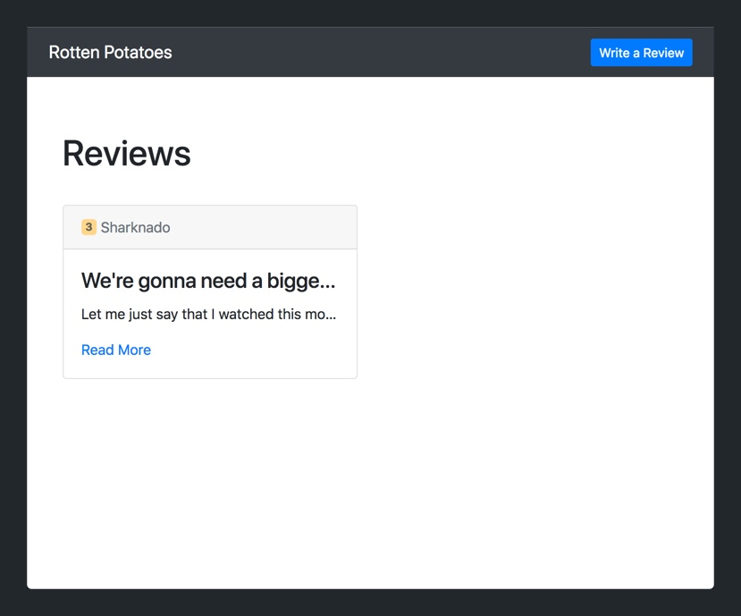
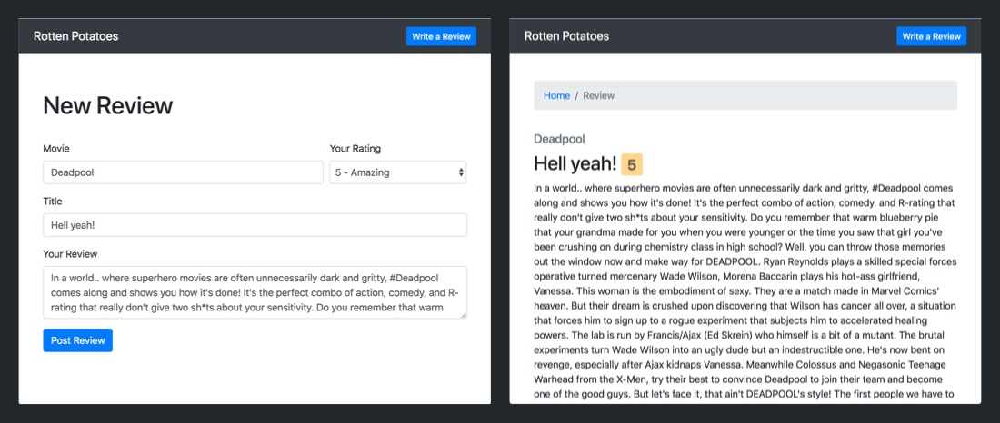

To wrap up our review website, we'll learn how to read (retrieve) reviews from our database. After all, it's not much use storing data if you can't access it again.

To read review data from our database, we'll need to build a query. A query allows you to read data from your database. You can add filters to your query to specify details about the data you want to retrieve. 

In this tutorial, we'll focus on the two simplest queries: querying all and querying a single item by ID.

# Querying All Reviews

First, we're going to populate our homepage with REAL data, instead of the sample data from the `reviews` array that we're currently using. We can do this easily with the `.find()` method that `mongoose` provides.

Let's go ahead and delete our `reviews` array. We won't need it anymore.

> [action]
>
In `routes/index.js`, delete the `reviews` array.

Next, we'll modify our index `/` route to query all reviews from our database using the `.find()` method on our mongoose model.

> [action]
>
In `routes/index.js`, modify the callback of your index `/` route to the following:
>
```
// ...
>
router.get('/', (req, res) => {
  // 1
  Review.find({}, (err, reviews) => {
    if (err) {
      console.log(err);
    }
>
    res.render('reviews/index', {
      reviews: reviews
    });
  });
});
>
// ...
```
>
We modify our callback to query all reviews using the `.find()` method. The first argument specifies that we don't want to add any filters to our query, and instead want all review records in our database.

Refresh your browser and go to `localhost:3000`. You should see the previous movie reviews you left:



Next, we'll learn to query a single record using an Id.

# Displaying a Single Review

The last route we'll implement will be to display a single review given an Id. These types of webpages usually display more information or the full details about a given record.

Let's create a new route for this webpage.

> [action]
>
In `routes/index.js`, add the code below for a new route. Make sure to the code below your existing routes.
>
```
// ...
>
// 1
router.get('/reviews/:id', (req, res) => {
  // 2
  Review.findById(req.params.id, (err, review) => {
    if (err) {
      console.log(err);
    }
>
    // 3
    res.render('reviews/show', {
      review: review
    });
  });
});
>
// ...
```
>
Breaking down our new route step-by-step:
>
1. We create a new route that takes an GET request with the URL path `/reviews/:id`. This is a special URL path because it has the `:id` value in it. This ID corresponds to the Id of the review we want to display.
1. Use the `mongoose` model's `.findById` to query the database for a record with the given Id. 
1. Once we read the data from our database, if there are no errors, we display the review in a new `reviews/show` template.

We'll need to create a new `views/reviews/show` Handlebars template for our new route.

> [action]
>
In your `views/reviews` folder, create a new file named `show.hbs`:
>
```
<div class="row">
    <div class="col">
        <nav aria-label="breadcrumb">
            <ol class="breadcrumb review-breadcrumb">
                <li class="breadcrumb-item"><a href="/">Home</a></li>
                <li class="breadcrumb-item active" aria-current="page">Review</li>
            </ol>
        </nav>
    </div>
</div>
>
<div class="row">
    <div class="col">
        <h5 class="text-muted">{{review.movieName}}</h5>
        <h2>{{review.title}} <span class="badge badge-rating">{{review.rating}}</span></h2>
    </div>
</div>
>
<div class="row">
    <div class="col">
        <p>{{review.body}}</p>
    </div>
</div>
```
>
Above, we add some HTML content to display our full movie review. We use the Bootstrap [breadcrumb](https://getbootstrap.com/docs/4.0/components/breadcrumb/) component to help the user navigate back to the homepage.

Let's add some spacing to our breadcrumb component.

> [action]
>
In `public/stylesheets/style.css`, add the following to the bottom of your CSS file:
>
```CSS
.review-breadcrumb {
    margin: 45px 0 35px;
}
```
>
We add some margin spacing to the top and bottom of the component.

Perfect. Next, we'll change some of our code to make use of our new show page.

On our homepage, let's add a _Read More_ button to each of our movie review cards. When the user clicks this button, they'll be taken to the show page we just created.

> [action]
>
In `views/index`, add the following `<a>` element within your `.card-body` `<div>`.
>
```
// ...
>
<div class="card-body">
    <h4 class="card-title">{{this.title}}</h4>
    <p class="card-text">{{this.body}}</p>
>
    <a class="card-link" href="/reviews/{{this._id}}">Read More</a>
</div>
>
// ...
```
>
We set the `href` attribute to point at the URL path `/reviews/{{this.id}}`. When the user clicks on the link, they'll be directed to our show route.

One more change. Let's modify our POST request so that when a new review is created, the user is redirected to the individual review's show page instead of back to the homepage.

> [challenge]
>
In `routes/index.js`, modify your index `/` route so that once the review is saved in the database, given no errors, the user will be redirected to the `/reviews/:id` show page.

<!-- break -->

> [solution]
>
In `routes/index.js`, you should have modify your index `/` route to the following:
>
```
router.post('/reviews', (req, res) => {
  const review = new Review(req.body);
>
  review.save(function(err, review) {
    if (err) {
      console.log(err);
    }
>
    // 1
    return res.redirect('/reviews/' + review._id);
  });
});
```

Let's take our new web app for a test run. Create a new movie review.

You should see the following:



Next, let's click the any of the _Read More_ buttons on our homepage. As expected, we'll see:


Congrats! You've finished implemented all of the features for your first web app. In the next section, we'll review what we learned and talk about where to go next.
