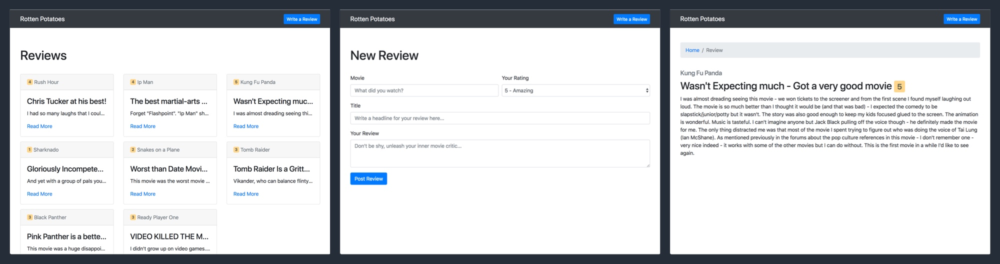

Congrats! You've just built your first full-stack web app with Node.js and Express.

Through this tutorial, you've seen first hand, how a HTTP request is sent, processed and returned from the back-end. To do so, we learned about many new concepts including:

- how the NodeJS and ExpressJS ecosystem works
- how to setup a new express app using Express generator
- how to install 3rd party packages with NPM
- how to pass data to dynamically generate our Handlebars templates
- how to read and write to and from our database with Mongoose
- how to handle HTTP requests with routes

Quite a feat! This is the starting point of being able to build far more complex projects.

We've introduce a lot of new concepts and terminology in this tutorial. If you're still a little fuzzy, don't worry. A lot of what you've learned will be reinforced in the upcoming tutorial.

## Where To Go From Here?

Now that we've dipped our toes into the waters of full-stack development, we're going to dive deeper. In this tutorial, we covered the fundamental concepts of building a back-end, but there's so much more.

When you've caught your breath, proceed to the next tutorial where you'll learn about intermediate concepts in full-stack development by building a clone of [_Reddit_](https://www.reddit.com/).
